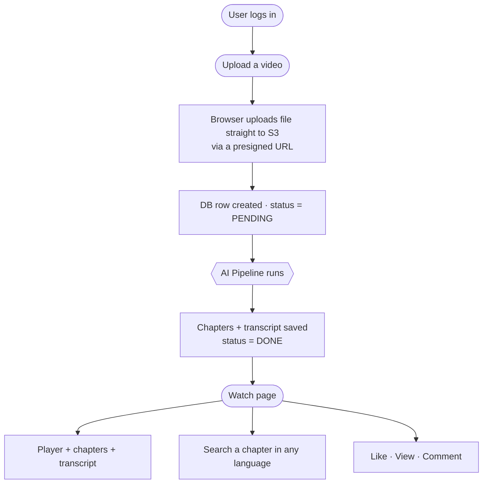
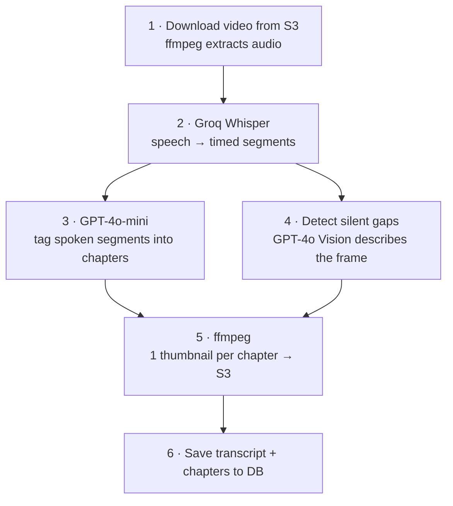
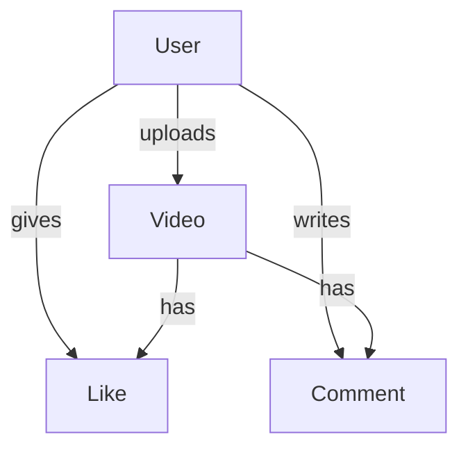

# Architecture

## Stack
| Layer | Tech |
|-------|------|
| Frontend | Next.js 14 App Router · Tailwind CSS |
| Auth | NextAuth.js (email + bcrypt) |
| Database | Neon PostgreSQL via Prisma |
| File Storage | AWS S3 (browser uploads directly via presigned URL) |
| Transcription | Groq Whisper (`whisper-large-v3-turbo`) |
| Tagging / Search / Vision | OpenAI GPT-4o-mini · GPT-4o |
| Video Processing | ffmpeg-static (audio · silence detect · thumbnails) |

---

## System Flow (top → bottom)

While the pipeline runs, the page polls every 2s until status is `DONE`.

---

## The AI Pipeline (top → bottom)

| Step | What it does |
|------|--------------|
| 1 | Pull the video from S3, extract a 16kHz mono audio track. |
| 2 | Groq Whisper transcribes speech into timed segments (noise/hallucinations filtered). |
| 3 | GPT-4o-mini picks the video's phases and tags each segment → **chapters**. |
| 4 | Silent stretches get a frame described by GPT-4o Vision → so wordless videos also get chapters. |
| 5 | ffmpeg grabs one thumbnail per chapter and uploads it to S3. |
| 6 | Everything is saved to Postgres; status becomes `DONE`. |

---

## Data Model

`Video.transcriptStatus`: `PENDING → PROCESSING → DONE` (or `FAILED`).
`transcriptSegments` = full timed transcript · `topicSegments` = the chapters (tag, time range, thumbnail).

---

## Key files

| File | Role |
|------|------|
| `src/app/api/upload/route.ts` | Presigned S3 URL + create `Video` row |
| `src/app/api/videos/[id]/transcribe/route.ts` | The full AI pipeline (steps 1–6) |
| `src/app/api/videos/[id]/transcript/route.ts` | Status / transcript polling |
| `src/app/api/videos/[id]/search-chapter/route.ts` | Multilingual chapter search |
| `src/lib/s3.ts` | S3 helpers (presign · upload · download) |
| `src/lib/auth.ts` · `src/lib/prisma.ts` | NextAuth config · Prisma client |
