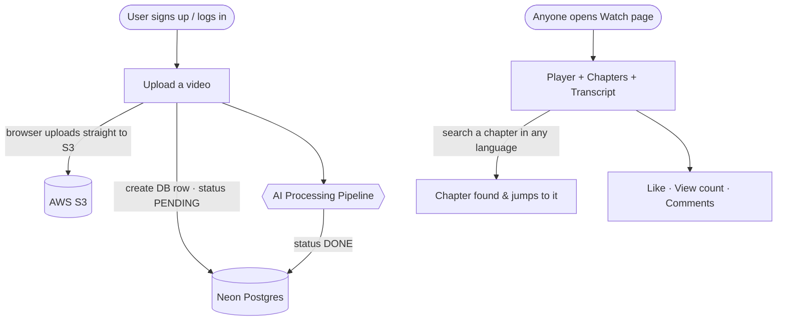
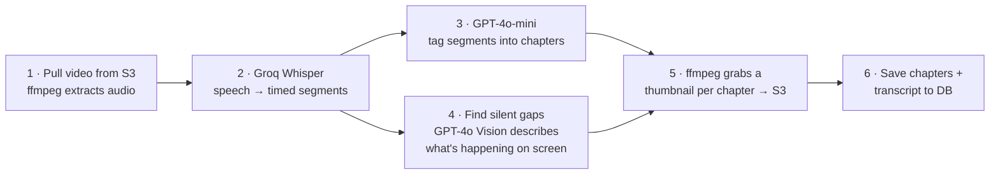
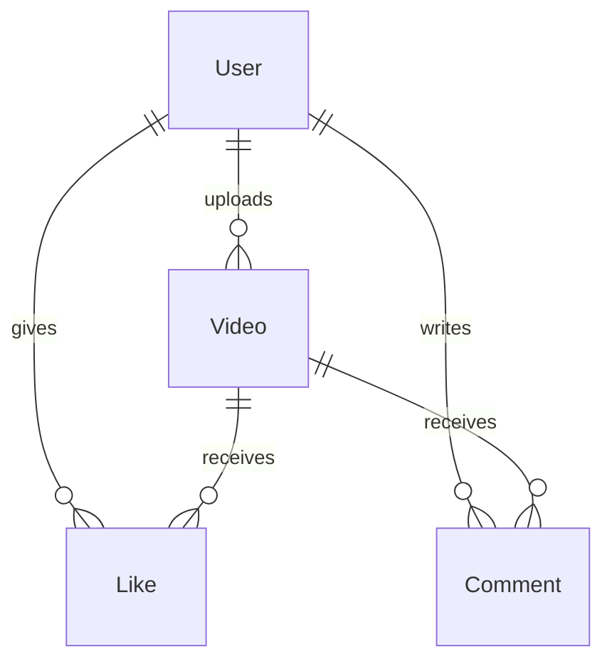

# YouTube Clone

A full-stack video platform. Users upload videos, and an **AI pipeline** auto-transcribes them, splits them into searchable chapters (even for silent/no-speech parts), and generates thumbnails — then anyone can watch, search chapters in any language, like, and comment.

---

## How it works (end to end)



Auth uses **NextAuth + bcrypt**. The upload is a **presigned URL**, so the big video file goes from the browser **directly to S3** (the server never holds it).

---

## The AI Processing Pipeline

Runs once after upload (`/api/videos/[id]/transcribe`). This is the heart of the project:



| Step | What happens |
|------|--------------|
| 1 | Download the video from S3, extract a 16kHz mono audio track with **ffmpeg**. |
| 2 | **Groq Whisper** transcribes speech into time-stamped segments (hallucinated noise is filtered out). |
| 3 | **GPT-4o-mini** reads the transcript, picks the video's phases, and tags each segment → these become **chapters**. |
| 4 | Silent / no-speech stretches are detected (ffmpeg `silencedetect` + Whisper gaps). **GPT-4o Vision** looks at a frame and writes what the person is doing — so even wordless videos get chapters. |
| 5 | **ffmpeg** grabs one thumbnail per chapter and uploads it to S3. |
| 6 | Chapters + full transcript are saved to Postgres; status flips to **DONE**. The watch page was polling and now renders everything. |

**Extra:** multilingual **chapter search** — GPT-4o-mini matches your query to a chapter, translating any language (Hindi, Hinglish, etc.) to English first.

---

## Tech Stack

| Layer | Tech |
|-------|------|
| Framework / UI | Next.js 14 (App Router), TypeScript, Tailwind CSS |
| Auth | NextAuth.js + bcrypt |
| Database | Neon PostgreSQL via Prisma |
| Video storage | AWS S3 (presigned uploads) |
| Audio/Video | ffmpeg-static (audio extract, silence detect, thumbnails) |
| AI | Groq Whisper (transcription) · OpenAI GPT-4o & 4o-mini (tagging, vision, search) |
| Hosting | Vercel (auto-deploy from GitHub) |

---

## Data Model



`Video` also stores `transcript`, `transcriptSegments`, `topicSegments` (chapters), and a `transcriptStatus` of `PENDING → PROCESSING → DONE`.

---

## Local Setup

```bash
git clone https://github.com/Shashanksharma280201/youtube-clone.git
cd youtube-clone
npm install
npx prisma generate && npx prisma db push
npm run dev          # → http://localhost:3000
```

Create `.env.local`:

```bash
DATABASE_URL=          # Neon connection string
NEXTAUTH_SECRET=       # openssl rand -base64 32
NEXTAUTH_URL=http://localhost:3000
AWS_ACCESS_KEY_ID=     # S3 video storage
AWS_SECRET_ACCESS_KEY=
AWS_REGION=
AWS_S3_BUCKET=
GROQ_API_KEY=          # Whisper transcription
OPENAI_API_KEY=        # tagging, vision, chapter search
```

---

## Scripts

```bash
npm run dev        # dev server
npm run build      # production build
npm run db:push    # apply schema to DB
npm run db:studio  # visual DB browser
```
